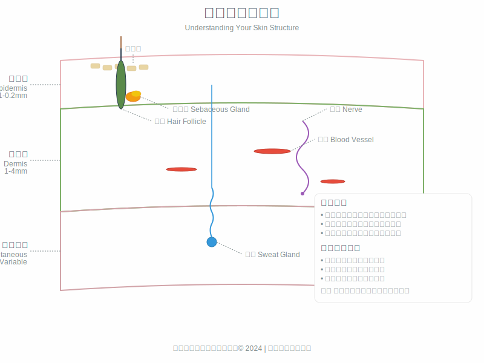
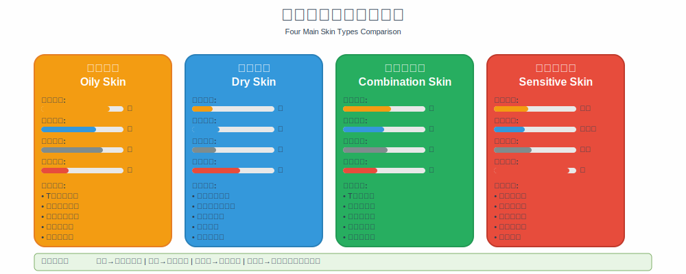
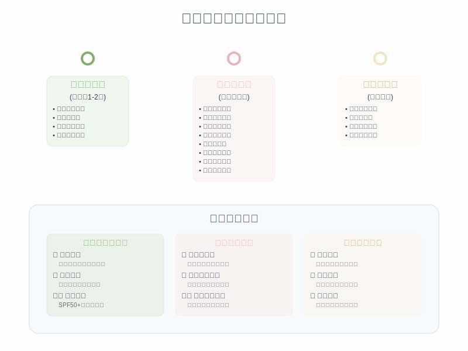
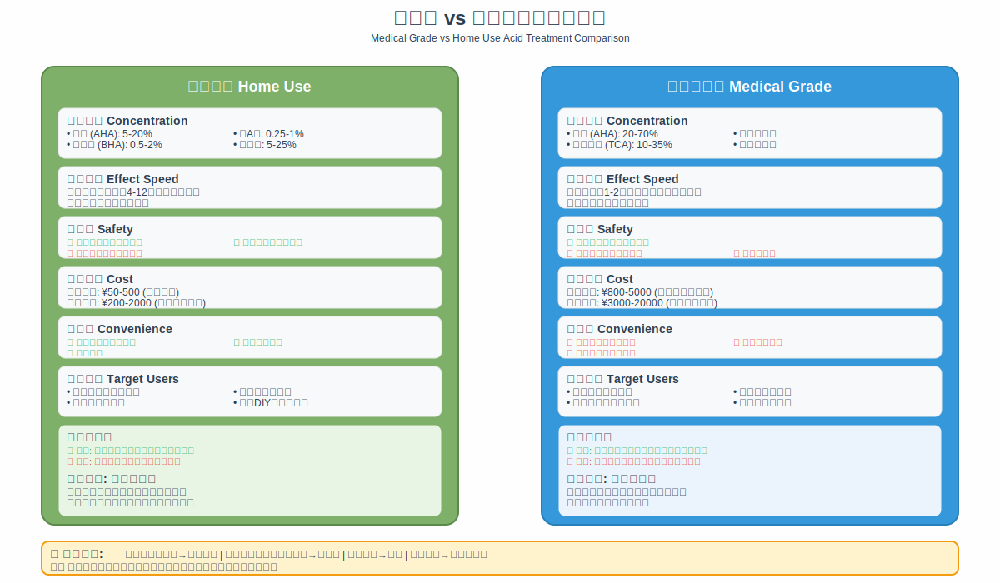
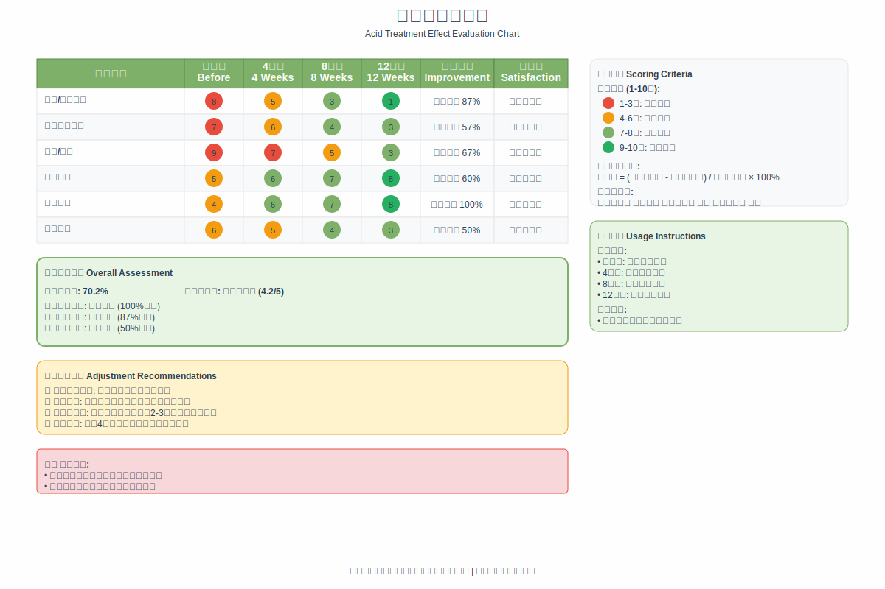

# 图表索引

本书包含15个专业制作的SVG图表，为读者提供直观的视觉指导。所有图表均采用统一的设计风格，以科学准确性和视觉清晰度为设计原则。

## 图表列表

### 基础知识图表

#### 1. 肌肤结构示意图
**位置**: 第1章 - 认识你的肌肤  
**文件**: `images/01_skin_structure.svg`  
**内容**: 表皮层、真皮层、皮下组织的详细结构，包含毛囊、皮脂腺、汗腺、血管、神经等解剖结构  
**用途**: 帮助读者理解肌肤的基本结构和各层功能

#### 2. 肌肤类型对比图
**位置**: 第1章 - 认识你的肌肤  
**文件**: `images/01_skin_types_comparison.svg`  
**内容**: 油性、干性、混合性、敏感性四大肌肤类型的特征对比  
**用途**: 协助读者识别自己的肌肤类型

#### 3. 肌肤更新周期图
**位置**: 第2章 - 刷酸科学原理  
**文件**: `images/02_skin_renewal_cycle.svg`  
**内容**: 28天肌肤更新周期的完整过程，展示细胞从基底层到角质层的移动过程  
**用途**: 说明刷酸如何影响肌肤的自然更新过程

#### 4. 酸类作用机制图
**位置**: 第2章 - 刷酸科学原理  
**文件**: `images/02_acid_mechanism.svg`  
**内容**: 酸类成分在肌肤中的作用机制和生物化学过程  
**用途**: 解释刷酸的科学原理

### 成分与产品图表

#### 5. 酸类浓度选择指南
**位置**: 第3章 - 酸类成分大百科  
**文件**: `images/03_acid_concentration_guide.svg`  
**内容**: 不同酸类的安全浓度区间和使用建议  
**用途**: 指导读者选择合适的产品浓度

#### 6. 酸类分子结构对比图
**位置**: 第3章 - 酸类成分大百科  
**文件**: `images/03_acid_molecules.svg`  
**内容**: 主要酸类成分的分子结构和特性对比  
**用途**: 说明不同酸类的化学特性差异

#### 7. 酸类分类图
**位置**: 第3章 - 酸类成分大百科  
**文件**: `images/02_acid_classification.svg`  
**内容**: 酸类成分的科学分类体系  
**用途**: 帮助读者理解酸类的分类和特点

### 实践指导图表

#### 8. 刷酸步骤流程图
**位置**: 第5章 - 新手刷酸入门指南  
**文件**: `images/05_acid_application_steps.svg`  
**内容**: 刷酸的标准操作流程和注意事项  
**用途**: 提供详细的操作指导

#### 9. 肌肤问题诊断决策树
**位置**: 第6章 - 不同肌肤问题的刷酸方案  
**文件**: `images/06_problem_diagnosis_tree.svg`  
**内容**: 根据肌肤问题选择相应刷酸方案的决策流程  
**用途**: 帮助读者制定个性化的刷酸方案

#### 10. 产品选择决策树
**位置**: 第7章 - 刷酸产品选择与搭配  
**文件**: `images/07_product_selection_tree.svg`  
**内容**: 产品选择的科学决策流程  
**用途**: 指导读者选择合适的刷酸产品

### 护理与管理图表

#### 11. 护理时间轴
**位置**: 第8章 - 刷酸过程中的护理要点  
**文件**: `images/08_care_timeline.svg`  
**内容**: 刷酸前中后的完整护理流程和时间安排  
**用途**: 提供系统的护理指导

#### 12. 医美与家用对比图
**位置**: 第9章 - 医美级刷酸项目  
**文件**: `images/09_medical_vs_home_comparison.svg`  
**内容**: 医美级与家用刷酸的全面对比分析  
**用途**: 帮助读者选择合适的治疗方式

#### 13. 风险分类图
**位置**: 第10章 - 刷酸安全与风险防控  
**文件**: `images/10_risk_classification.svg`  
**内容**: 刷酸风险的分级和应对策略  
**用途**: 提高读者的安全意识

#### 14. 效果评估表格
**位置**: 第11章 - 刷酸效果评估与调整  
**文件**: `images/11_effect_evaluation_chart.svg`  
**内容**: 科学的效果评估方法和标准  
**用途**: 指导读者客观评估刷酸效果

#### 15. 生活方式影响图
**位置**: 第12章 - 刷酸期间的生活管理  
**文件**: `images/12_lifestyle_impact_chart.svg`  
**内容**: 生活方式对刷酸效果的影响分析  
**用途**: 强调全面生活管理的重要性

### 附录图表

#### 16. 产品选择矩阵
**位置**: 附录A - 产品选择指南  
**文件**: `images/appendix_product_matrix.svg`  
**内容**: 按肌肤类型和需求分类的产品选择矩阵  
**用途**: 提供系统的产品选择参考

#### 17. 刷酸日记模板
**位置**: 附录C - 刷酸记录模板  
**文件**: `images/appendix_diary_template.svg`  
**内容**: 标准化的刷酸记录模板  
**用途**: 帮助读者建立科学的记录习惯

## 图表设计原则

### 科学准确性
所有图表内容均基于科学研究和专业知识，确保信息的准确性和可靠性。

### 视觉清晰度
采用清晰的视觉层次和合理的信息密度，确保读者能够快速理解图表内容。

### 一致性
所有图表采用统一的设计风格、色彩方案和排版规范，保持整体的一致性。

### 实用性
图表设计注重实用性，为读者提供可操作的指导和参考。

## 使用说明

### 查看方式
所有图表均为SVG格式，支持无损缩放，可在各种设备上清晰显示。

### 引用规范
如需引用本书图表，请注明出处和版权信息。

### 技术支持
如在查看图表时遇到技术问题，请检查浏览器的SVG支持情况。

## 版权声明

本书所有图表均为原创设计，受著作权法保护。未经授权，不得用于商业用途或进行修改再发布。
