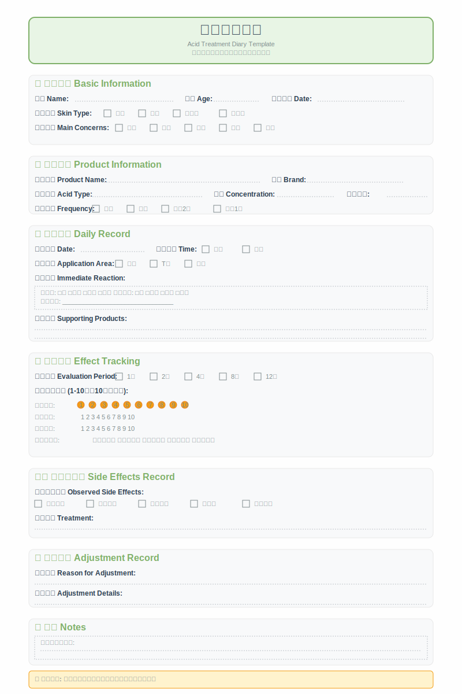

# 附录C：刷酸记录模板



*附录图C-1：刷酸日记标准模板*

## 记录的重要性

建立详细的刷酸记录对于优化护肤方案具有重要意义。通过系统性的记录，可以客观追踪肌肤状态的变化，识别有效的产品和方法，及时发现和处理问题。

记录还有助于建立个人的护肤数据库，为后续的产品选择和使用调整提供参考。长期的记录数据能够揭示肌肤变化的规律和趋势。

## 基础信息记录

### 个人基本信息

记录基本的个人信息，包括年龄、性别、肌肤类型等。这些信息有助于分析肌肤反应的个体差异。

年龄是影响肌肤状态和反应的重要因素，不同年龄段的肌肤特点和需求不同。

肌肤类型的准确识别是选择合适产品和方法的基础。可以通过专业测试或自我评估来确定。

### 肌肤基础状态

详细记录开始刷酸前的肌肤状态，包括主要问题、严重程度、分布区域等。这是评估后续效果的重要基线。

可以采用评分制来量化肌肤问题的严重程度，如1-10分制，便于后续的对比分析。

拍摄标准化的照片作为视觉记录，建议在相同的光线条件和角度下拍摄。

### 既往护肤经历

记录之前使用过的护肤产品和方法，特别是酸类产品的使用经历。这有助于预测肌肤的耐受性和反应。

如果有过敏史或不良反应史，要详细记录，为产品选择提供参考。

## 产品使用记录

### 产品信息

详细记录使用的产品信息，包括品牌、产品名称、主要成分、浓度、pH值等。这些信息对于效果分析很重要。

记录产品的批号和生产日期，有助于追踪产品质量问题。

记录购买渠道和价格，为性价比分析提供数据。

### 使用方法

记录具体的使用方法，包括使用时间、频率、用量、涂抹方式等。标准化的使用方法有助于准确评估效果。

记录与其他产品的搭配使用情况，包括使用顺序、时间间隔等。

记录环境因素，如季节、天气、室内温湿度等，这些因素可能影响产品效果。

### 使用感受

记录每次使用后的即时感受，包括刺激感、舒适度、吸收情况等。这些主观感受是重要的安全性指标。

使用数字评分或描述性语言来记录感受，保持记录的一致性。

## 肌肤反应记录

### 即时反应

记录使用产品后的即时反应，包括刺激感的程度和持续时间、肌肤颜色的变化、触感的变化等。

即时反应的记录有助于评估产品的刺激性和个人的耐受性。

### 短期变化

记录使用后24-48小时内的肌肤变化，包括干燥、脱皮、红肿等现象。

短期变化的记录有助于调整使用频率和方法。

### 长期效果

定期记录肌肤状态的长期变化，建议每周或每两周进行一次全面评估。

使用标准化的评估方法，如拍照对比、评分记录等。

## 效果评估记录

### 主观评估

记录对肌肤改善的主观感受，包括质感、外观、舒适度等方面的变化。

使用一致的评估标准，如1-10分制或描述性等级。

### 客观指标

如果有条件，记录客观的肌肤参数，如水分含量、油脂分泌量、色素分布等。

拍摄标准化的对比照片，记录视觉上的变化。

### 他人反馈

记录家人朋友对肌肤变化的评价，这可以减少自我评估的主观偏差。

## 问题与调整记录

### 不良反应

详细记录出现的任何不良反应，包括症状、严重程度、持续时间、处理方法等。

不良反应的记录对于产品安全性评估和后续选择很重要。

### 方案调整

记录对使用方案的任何调整，包括调整的原因、具体内容、调整后的效果等。

方案调整的记录有助于找到最适合的使用方法。

### 产品更换

记录产品更换的情况，包括更换原因、新产品信息、过渡方法等。

## 环境与生活因素记录

### 季节变化

记录不同季节对肌肤状态和产品效果的影响。

季节性的记录有助于制定全年的护肤计划。

### 生活方式

记录可能影响肌肤状态的生活因素，如睡眠质量、饮食习惯、压力水平、运动情况等。

生活方式的记录有助于全面分析肌肤变化的原因。

### 其他因素

记录其他可能影响肌肤的因素，如生理周期、疾病、药物使用等。

## 记录模板示例

### 日常使用记录

```
日期：____年____月____日
产品：________________
使用时间：____________
使用量：______________
即时反应：____________
当日肌肤状态：________
备注：________________
```

### 周度评估记录

```
评估日期：____年____月____日
使用产品：____________
使用频率：____________
肌肤改善评分：________
主要变化：____________
需要调整：____________
下周计划：____________
```

### 月度总结记录

```
总结月份：____年____月
主要使用产品：________
总体效果评估：________
最满意的改善：________
遇到的问题：__________
下月调整计划：________
```

## 记录分析方法

### 数据整理

定期整理记录数据，制作图表或表格，便于分析趋势和规律。

可以使用电子表格或专门的应用程序来管理记录数据。

### 效果分析

通过对比不同时期的记录，分析产品效果和肌肤变化趋势。

识别最有效的产品和方法，为后续使用提供指导。

### 问题识别

通过记录分析，及时识别潜在的问题和风险。

找出导致不良反应的可能原因，避免重复发生。

## 本附录要点总结

建立详细的刷酸记录对于优化护肤方案具有重要价值。

记录应该包括基础信息、产品使用、肌肤反应、效果评估等多个方面。

使用标准化的记录方法和评估标准，保持记录的一致性和可比性。

定期分析记录数据，识别有效的方法和潜在的问题。

记录不仅是过程的记录，更是科学护肤的重要工具。

通过坚持记录和分析，每个人都能找到最适合自己的刷酸方案。
