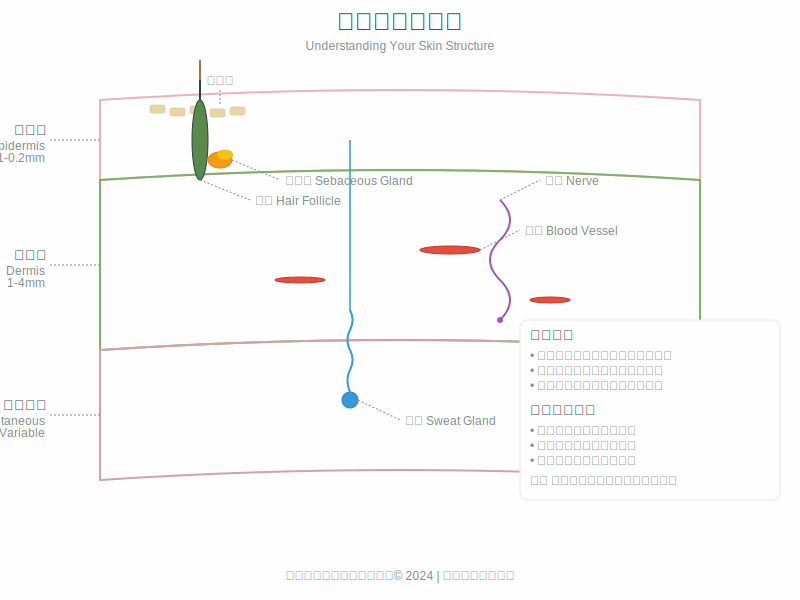
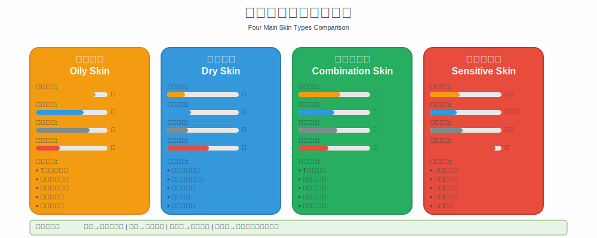

# 第1章：认识你的肌肤

## 开篇：了解肌肤的重要性

了解肌肤的基本结构和功能是进行任何护肤治疗的前提。肌肤作为人体最大的器官，具有复杂的生理结构和多重功能。只有深入理解肌肤的工作原理，才能制定出科学有效的护肤方案。

许多护肤问题的根源在于对肌肤认识不足。不同的肌肤类型有着不同的特点和需求，盲目使用护肤产品往往难以达到理想效果，甚至可能造成肌肤问题。因此，认识和了解自己的肌肤是护肤成功的第一步。

*图1-1：肌肤三层结构详解*

## 肌肤解剖学：三层结构详解

### 肌肤的基本结构

人体肌肤由三个主要层次组成，每一层都有其独特的结构和功能。这种分层结构使肌肤能够有效地保护内部组织，同时维持正常的生理功能。

表皮层是肌肤的最外层，直接与外界环境接触。虽然厚度只有0.1-0.2毫米，但它承担着极其重要的保护功能。表皮层主要由角质形成细胞组成，这些细胞从基底层开始，经过不断的分化和角化过程，最终形成角质层。

表皮层的更新周期约为28天，这个过程被称为角质更新周期。在这个周期中，新生的细胞从基底层逐渐向上移动，经过棘层、颗粒层，最终到达角质层并脱落。这个自然的更新过程是维持肌肤健康的重要机制。

角质层是表皮的最外层，由15-20层已经死亡的角质细胞组成。这些细胞紧密排列，形成肌肤的第一道防线。角质层的主要功能包括防止水分流失、阻挡外界有害物质入侵、以及维持肌肤的完整性。

真皮层位于表皮层下方，是肌肤的主要结构层。真皮层的厚度约为表皮层的10-20倍，主要由胶原蛋白、弹性蛋白和基质组成。胶原蛋白提供结构支撑，维持肌肤的紧致度；弹性蛋白赋予肌肤弹性，使其能够在拉伸后恢复原状；基质则填充在纤维之间，含有大量的透明质酸等保湿成分。

真皮层还包含血管、神经、毛囊、皮脂腺和汗腺等重要结构。血管系统负责为肌肤提供营养和氧气，同时带走代谢废物。神经系统使肌肤具有感觉功能。毛囊、皮脂腺和汗腺则参与肌肤的保护和调节功能。

皮下组织是肌肤的最深层，主要由脂肪细胞组成。这一层的主要功能包括保温隔热、缓冲外力冲击、以及储存能量。皮下组织的厚度因人而异，也会随着年龄、营养状况等因素发生变化。

### 肌肤屏障功能

肌肤屏障是保护机体免受外界伤害的重要防线，主要由皮脂膜和角质层构成。这个屏障系统的完整性直接影响肌肤的健康状态。

皮脂膜是覆盖在肌肤表面的一层薄膜，由皮脂腺分泌的油脂、汗腺分泌的汗液以及角质细胞产生的天然保湿因子混合形成。这层薄膜具有弱酸性，pH值约为5.5，能够抑制有害细菌的繁殖，同时防止水分过度流失。

角质层的屏障功能主要通过其独特的"砖墙结构"实现。在这个结构中，角质细胞如同砖块，细胞间脂质如同水泥，两者紧密结合形成坚固的屏障。细胞间脂质主要由神经酰胺、胆固醇和游离脂肪酸组成，这些成分对维持屏障功能至关重要。

当肌肤屏障功能受损时，会出现一系列问题。水分流失增加导致肌肤干燥，外界刺激物更容易渗透引起敏感反应，细菌感染的风险也会增加。因此，维护肌肤屏障功能是护肤的基本原则之一。

## 肌肤类型分析

### 肌肤类型的分类标准

肌肤类型的分类主要基于皮脂分泌量和肌肤敏感性两个维度。皮脂分泌量决定了肌肤的油性程度，而敏感性则反映了肌肤对外界刺激的反应程度。

根据皮脂分泌量，可以将肌肤分为干性、中性、油性和混合性四种基本类型。干性肌肤皮脂分泌较少，容易出现紧绷、干燥、脱皮等现象。中性肌肤皮脂分泌适中，肌肤状态相对稳定。油性肌肤皮脂分泌旺盛，容易出现油光、毛孔粗大、痘痘等问题。混合性肌肤则表现为T区偏油，U区偏干的特点。

敏感性肌肤是一个特殊的分类，它可以与上述任何一种肌肤类型并存。敏感性肌肤的特点是对外界刺激反应强烈，容易出现红肿、刺痛、瘙痒等不适症状。

*图1-2：四大肌肤类型特征对比*

### 干性肌肤特征

干性肌肤的主要特征是皮脂分泌不足，肌肤缺乏天然油脂的保护。这类肌肤通常表现为肌肤紧绷、干燥、粗糙，容易出现细纹和脱皮现象。在寒冷干燥的环境中，这些症状会更加明显。

干性肌肤的毛孔通常较小，不易出现黑头和痘痘问题。但由于缺乏油脂保护，这类肌肤对外界刺激较为敏感，容易受到环境因素的影响。

干性肌肤的护理重点是补水保湿和修复屏障功能。需要选择温和的清洁产品，避免过度清洁。保湿产品应选择质地较为滋润的类型，含有神经酰胺、透明质酸等成分的产品效果较好。

### 油性肌肤特征

油性肌肤的特点是皮脂分泌旺盛，肌肤经常呈现油光状态。这类肌肤的毛孔通常较为粗大，容易出现黑头、白头和痘痘等问题。由于油脂分泌充足，油性肌肤不容易出现干燥和细纹。

油性肌肤的优势是不易衰老，因为充足的油脂分泌能够提供天然的保护。但过多的油脂也会带来问题，如毛孔堵塞、细菌繁殖等。

油性肌肤的护理重点是控制油脂分泌和保持毛孔通畅。清洁工作要做到位，但不能过度清洁以免刺激皮脂腺分泌更多油脂。保湿仍然重要，应选择清爽型的保湿产品。

### 混合性肌肤特征

混合性肌肤是最常见的肌肤类型，表现为面部不同区域有不同的肌肤特征。通常T区（额头、鼻子、下巴）偏油性，容易出现油光和毛孔粗大；U区（两颊）偏干性，可能出现干燥和紧绷感。

混合性肌肤的护理难点在于需要针对不同区域采用不同的护理方法。这种分区护理的概念对于混合性肌肤的护理至关重要。

T区需要重点控油和清洁，可以使用含有水杨酸等成分的产品。U区则需要加强保湿，选择滋润型的护肤产品。在选择全脸使用的产品时，应以温和、平衡为原则。

### 敏感性肌肤特征

敏感性肌肤不是一个独立的肌肤类型，而是一种肌肤状态。它可以与干性、油性或混合性肌肤并存。敏感性肌肤的主要特征是对外界刺激反应强烈，容易出现红肿、刺痛、瘙痒、灼热等不适症状。

导致肌肤敏感的原因很多，包括遗传因素、环境因素、护肤品使用不当、疾病等。敏感性肌肤的屏障功能通常较弱，对温度变化、化学物质、物理刺激等都比较敏感。

敏感性肌肤的护理原则是温和、简单、修复。应避免使用含有刺激性成分的产品，如高浓度的酸类、酒精、香精等。护肤步骤要尽量简化，重点做好清洁、保湿和防晒。

## 肌肤问题的成因分析

### 内在因素

肌肤问题的产生往往是多种因素共同作用的结果。内在因素主要包括遗传、激素水平、年龄、营养状况等。

遗传因素决定了个体的基本肌肤特征，包括肌肤类型、敏感程度、衰老速度等。这些特征在很大程度上是不可改变的，但可以通过适当的护理来改善。

激素水平的变化对肌肤状态有显著影响。青春期雄激素水平升高会导致皮脂分泌增加，容易出现痘痘问题。女性在月经周期、妊娠期、更年期等特殊时期，激素水平的波动也会影响肌肤状态。

年龄是影响肌肤状态的重要因素。随着年龄增长，肌肤的新陈代谢逐渐减缓，胶原蛋白和弹性蛋白的合成减少，肌肤逐渐出现松弛、皱纹等老化现象。

营养状况也会影响肌肤健康。缺乏维生素、矿物质、蛋白质等营养素会影响肌肤的正常功能。充足的营养供应是维持肌肤健康的基础。

### 外在因素

外在因素主要包括环境因素、生活方式、护肤习惯等。这些因素相对容易控制和改变。

紫外线是影响肌肤健康的主要环境因素。长期紫外线照射会导致光老化，表现为色斑、皱纹、肌肤粗糙等。空气污染、温度湿度变化等环境因素也会影响肌肤状态。

生活方式对肌肤健康有重要影响。睡眠不足会影响肌肤的修复和再生；压力过大会影响激素水平，进而影响肌肤状态；吸烟、饮酒等不良习惯会加速肌肤老化。

护肤习惯的正确与否直接影响肌肤健康。过度清洁、使用不适合的产品、护肤步骤错误等都可能导致肌肤问题。建立正确的护肤习惯是维护肌肤健康的关键。

## 肌肤评估方法

### 自我评估技巧

正确评估自己的肌肤状态是制定护肤方案的前提。自我评估可以通过观察、触摸、记录等方式进行。

观察是最直接的评估方法。在自然光线下，仔细观察肌肤的颜色、质感、毛孔大小、有无瑕疵等。不同时间的观察结果可能不同，建议在早晨清洁后和晚上卸妆后分别观察。

触摸可以了解肌肤的质感和弹性。用干净的手轻触肌肤，感受其光滑程度、弹性、温度等。注意不同区域可能有不同的感觉。

记录肌肤状态的变化有助于了解肌肤的规律和趋势。可以建立肌肤日记，记录每天的肌肤状态、使用的产品、环境因素等，寻找其中的关联性。

### 专业评估方法

专业的肌肤评估通常使用专门的仪器和技术，能够提供更准确、客观的结果。常用的评估方法包括肌肤水分测试、油脂分泌测试、弹性测试、色素分析等。

肌肤水分测试使用电导率原理，测量角质层的含水量。这个指标反映了肌肤的保湿状态和屏障功能。

油脂分泌测试通过吸油纸或专用仪器测量皮脂分泌量，有助于确定肌肤类型和制定相应的护理方案。

弹性测试评估肌肤的弹性和紧致度，通常使用负压吸引或机械拉伸的方法。这个指标与肌肤的老化程度密切相关。

色素分析使用特殊的光学设备，分析肌肤中黑色素的分布和含量，有助于评估色斑、肤色不均等问题。

虽然专业评估更加准确，但对于日常护肤来说，掌握基本的自我评估技巧已经足够。重要的是要定期评估，及时调整护肤方案。

## 本章要点总结

了解肌肤的基本结构和功能是科学护肤的基础。肌肤由表皮层、真皮层和皮下组织三层构成，每一层都有其独特的功能。肌肤屏障是保护机体的重要防线，维护其完整性是护肤的基本原则。

肌肤类型主要分为干性、油性、混合性和敏感性四种。不同类型的肌肤有不同的特点和护理需求，需要采用相应的护理方法。

肌肤问题的产生是内在因素和外在因素共同作用的结果。了解这些因素有助于预防和改善肌肤问题。

正确评估肌肤状态是制定护肤方案的前提。掌握基本的自我评估技巧，定期观察和记录肌肤变化，有助于及时调整护肤策略。

记住，每个人的肌肤都是独特的，需要个性化的护理方案。通过深入了解自己的肌肤，才能找到最适合的护肤方法，实现理想的肌肤状态。

---

了解了肌肤的基本知识后，接下来我们将深入学习刷酸的科学原理。让我们进入下一章"刷酸科学原理"，探索酸类成分如何改善肌肤！
