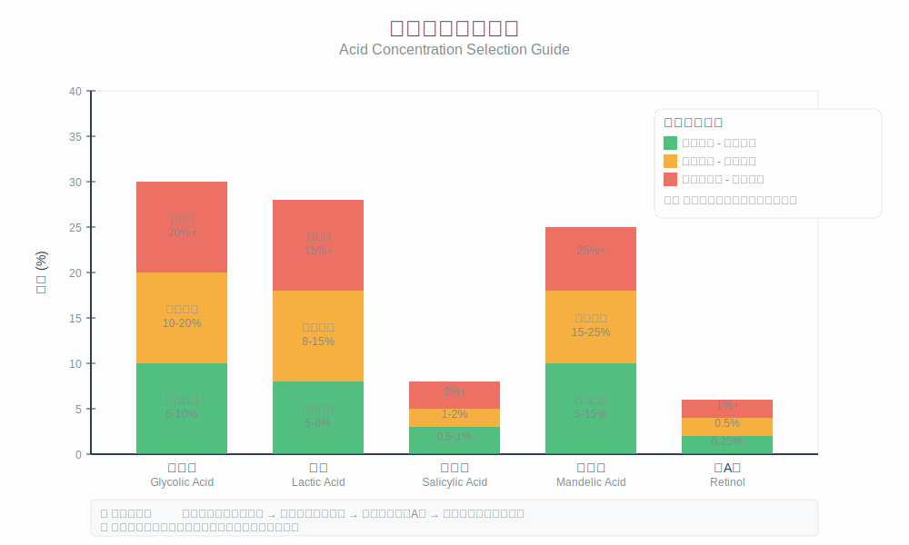

# 第3章：酸类成分大百科

## 开篇：认识酸类成分

市面上的酸类成分种类繁多，每种酸都有其独特的化学特性和生物活性。了解不同酸类的分子结构、作用机制和适用范围，是科学选择和使用刷酸产品的基础。

不同的酸类成分在分子大小、溶解性、渗透能力、刺激程度等方面存在显著差异。这些差异决定了它们在实际应用中的效果和安全性。通过系统了解各种酸类的特点，可以根据个人肌肤状况和护肤目标做出最适合的选择。

*图3-1：不同酸类的浓度选择指南*

## 酸类成分分类体系

### 按化学结构分类

酸类成分根据其化学结构可以分为几个主要类别，每个类别都有其独特的化学特性和生物活性。

α-羟基酸是最常见的酸类，包括甘醇酸、乳酸、苹果酸、柠檬酸等。这类酸的特点是羟基位于α位置，具有水溶性，分子相对较大，主要作用于肌肤表面。α-羟基酸在去角质的同时通常具有一定的保湿效果。

β-羟基酸的代表是水杨酸，这是护肤领域中应用最广泛的β-羟基酸。水杨酸具有脂溶性特点，分子较小，能够深入毛孔发挥作用。这种特性使得β-羟基酸特别适合处理毛孔堵塞和油脂分泌过多的问题。

多羟基酸是相对较新的酸类，包括乳糖酸、葡萄糖酸等。这类酸的分子量较大，渗透性相对较弱，因此刺激性也最小。多羟基酸除了去角质效果外，还具有保湿和抗氧化作用。

### 按作用强度分类

根据作用强度和刺激程度，酸类可以分为温和级、中等级和强效级三个等级。

温和级酸类适合敏感肌肤和初学者使用，包括低浓度的乳酸、杏仁酸和多羟基酸。这类酸的刺激性较小，但仍能提供有效的去角质效果。

中等级酸类适合大多数肌肤类型，包括中等浓度的甘醇酸、水杨酸等。这类酸在效果和安全性之间取得了良好的平衡。

强效级酸类主要用于专业治疗或有经验的使用者，包括高浓度的甘醇酸、复合酸配方等。这类酸的效果显著，但需要谨慎使用。

*图3-2：主要酸类的分子结构对比*

## α-羟基酸类详解

### 甘醇酸

甘醇酸是分子量最小的α-羟基酸，分子量仅为76道尔顿。这种小分子特性使得甘醇酸具有最强的渗透能力，能够有效穿透角质层发挥作用。

甘醇酸主要来源于甘蔗，也可以通过化学合成获得。作为水溶性酸类，甘醇酸主要作用于肌肤表面和浅层，通过降低角质细胞间的粘附力来促进角质脱落。

在护肤应用中，甘醇酸的有效浓度范围通常在5%-15%之间。低浓度的甘醇酸适合日常护理，而高浓度的甘醇酸则主要用于专业治疗。甘醇酸的最佳pH值范围在3.5-4.0之间。

甘醇酸的主要功效包括促进角质更新、改善肌肤质感、减少细纹、淡化色斑等。长期使用甘醇酸还可能刺激胶原蛋白合成，对抗衰老有一定帮助。

由于分子较小，甘醇酸的刺激性相对较强。初次使用者可能出现轻微的刺痛、红肿或脱皮现象。建议从低浓度开始，逐步建立耐受性。

### 乳酸

乳酸的分子量为90道尔顿，比甘醇酸稍大，因此渗透性相对温和。乳酸天然存在于发酵乳制品中，也是人体肌肤天然保湿因子的重要组成部分。

乳酸的独特优势在于其保湿特性。与其他α-羟基酸不同，乳酸在去角质的同时能够帮助肌肤保持水分，不会造成过度干燥。这种特性使得乳酸特别适合干性肌肤和敏感肌肤使用。

乳酸还具有一定的美白效果。研究表明，乳酸能够抑制酪氨酸酶的活性，减少黑色素的生成，对改善色斑和肤色不均有积极作用。

在浓度选择上，乳酸的安全使用范围相对较宽。2%-5%的浓度适合敏感肌肤，5%-10%的浓度适合大多数肌肤类型。乳酸的刺激性明显低于甘醇酸，不良反应的发生率也相对较低。

### 苹果酸

苹果酸的分子量为134道尔顿，是常见α-羟基酸中分子较大的一种。苹果酸天然存在于苹果等水果中，具有温和的去角质效果。

苹果酸的特色在于其抗氧化特性。除了基本的去角质功能外，苹果酸还能够清除自由基，保护肌肤免受氧化损伤。这种抗氧化作用对延缓肌肤老化有积极意义。

由于分子较大，苹果酸的渗透性相对较弱，刺激性也较小。这使得苹果酸成为敏感肌肤的理想选择之一。苹果酸常与其他酸类组合使用，以增强整体效果。

### 柠檬酸

柠檬酸主要用作pH调节剂和抗氧化剂，在护肤品中的浓度通常较低。虽然柠檬酸也具有一定的去角质效果，但其主要作用是维持产品的稳定性和安全性。

柠檬酸具有一定的美白效果，但由于其刺激性相对较强，很少作为主要的去角质成分使用。在复合酸配方中，柠檬酸更多地发挥辅助作用。

## β-羟基酸类详解

### 水杨酸

水杨酸是护肤领域中最重要的β-羟基酸，分子量为138道尔顿。与α-羟基酸不同，水杨酸具有脂溶性特点，能够溶解在油脂中，深入毛孔发挥作用。

水杨酸最初从柳树皮中提取，现在主要通过化学合成获得。其化学结构中含有苯环和羧基，这种结构赋予了水杨酸独特的生物活性。

水杨酸的主要优势在于其深层清洁能力。由于脂溶性特点，水杨酸能够穿透皮脂和角质栓，深入毛孔内部清除堆积的油脂和角质。这种特性使得水杨酸特别适合处理黑头、白头和痘痘问题。

水杨酸还具有显著的抗炎作用。它能够抑制炎症介质的释放，减轻肌肤的炎症反应。这种抗炎特性使得水杨酸不仅能够预防痘痘的形成，还能够缓解已有痘痘的炎症。

在浓度应用上，水杨酸的有效范围相对较窄。0.5%的浓度适合敏感肌肤和初学者，1%-2%的浓度适合大多数肌肤类型。超过2%的浓度通常只在专业治疗中使用。

水杨酸的使用需要特别注意防晒，因为它会增加肌肤对紫外线的敏感性。同时，水杨酸不适合与某些成分同时使用，如高浓度的维生素C等。

## 多羟基酸类详解

### 乳糖酸

乳糖酸是多羟基酸的代表成分之一，分子量较大，约为358道尔顿。由于分子量大，乳糖酸的渗透性相对较弱，但这也使得它的刺激性最小。

乳糖酸除了基本的去角质功能外，还具有优秀的保湿效果。它能够增加角质层的含水量，改善肌肤的水合状态。这种保湿特性使得乳糖酸特别适合干性肌肤使用。

乳糖酸还具有一定的抗氧化作用，能够保护肌肤免受自由基损伤。这种多重功效使得乳糖酸成为敏感肌肤和成熟肌肤的理想选择。

### 葡萄糖酸

葡萄糖酸是另一种重要的多羟基酸，具有与乳糖酸类似的特性。它的分子量也较大，刺激性很小，适合敏感肌肤使用。

葡萄糖酸的特色在于其螯合特性，能够结合金属离子，提高其他活性成分的稳定性。在复合配方中，葡萄糖酸常作为稳定剂使用。

## 新兴酸类成分

### 杏仁酸

杏仁酸是一种相对较新的α-羟基酸，分子量为152道尔顿。杏仁酸的分子量比甘醇酸和乳酸都大，因此渗透性更温和，刺激性也更小。

杏仁酸的独特之处在于其分子结构中含有苯环，这使得它具有一定的脂溶性特点。这种特性使得杏仁酸既能作用于肌肤表面，又能在一定程度上深入毛孔。

杏仁酸特别适合亚洲人的肌肤特点，对改善色素沉着有良好效果。同时，由于其温和性，杏仁酸也适合敏感肌肤使用。

### 壬二酸

壬二酸虽然不是传统意义上的羟基酸，但在护肤领域中具有重要地位。壬二酸具有独特的抗菌和抗炎特性，特别适合处理痘痘问题。

壬二酸的作用机制与传统酸类不同，它主要通过抑制细菌繁殖和减轻炎症来改善肌肤问题。壬二酸还具有一定的美白效果，能够抑制异常的黑色素生成。

## 酸类成分的选择原则

### 根据肌肤类型选择

不同的肌肤类型需要选择不同的酸类成分。干性肌肤适合选择具有保湿效果的酸类，如乳酸、多羟基酸等。油性肌肤适合选择具有控油效果的酸类，如水杨酸。

敏感肌肤需要选择刺激性最小的酸类，如多羟基酸、低浓度乳酸等。混合性肌肤可以采用分区护理的方式，在不同区域使用不同的酸类。

### 根据肌肤问题选择

不同的肌肤问题需要针对性地选择酸类成分。痘痘问题适合选择水杨酸或壬二酸，色斑问题适合选择乳酸或杏仁酸，抗衰老需求适合选择甘醇酸。

毛孔粗大问题需要选择能够深入毛孔的酸类，如水杨酸。肌肤粗糙问题适合选择去角质效果强的酸类，如甘醇酸。

### 浓度选择原则

酸类浓度的选择需要考虑个人的肌肤耐受性和使用经验。初学者应该从最低有效浓度开始，逐步建立耐受性。

不同酸类的有效浓度范围不同，需要根据具体成分来确定。同时，还要考虑产品的pH值、配方等因素对实际效果的影响。

## 本章要点总结

酸类成分种类繁多，每种酸都有其独特的化学特性和生物活性。α-羟基酸主要作用于肌肤表面，β-羟基酸能够深入毛孔，多羟基酸具有最佳的温和性。

不同酸类的分子大小、溶解性、渗透能力等特性决定了它们的适用范围和效果。了解这些特性有助于根据个人需求选择合适的酸类成分。

酸类的选择需要综合考虑肌肤类型、肌肤问题、个人耐受性等多种因素。正确的选择是安全有效使用酸类产品的前提。

浓度和pH值是影响酸类效果的重要因素，需要根据具体情况进行调整。建议从低浓度开始，逐步建立耐受性。

掌握各种酸类成分的特点和应用原则，有助于制定个性化的刷酸方案，实现最佳的护肤效果。

---

了解了各种酸类成分的特点后，接下来我们将学习刷酸前的准备工作。让我们进入下一章"刷酸前的准备工作"，确保安全有效地开始刷酸之旅！
