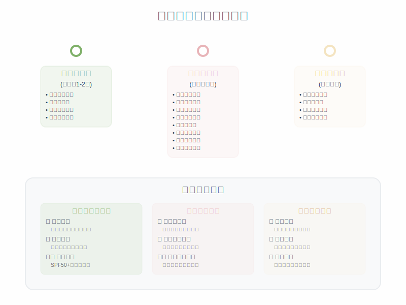

# 第8章：刷酸过程中的护理要点

## 开篇：科学护理的重要性

刷酸过程中的护理工作直接影响着治疗效果和肌肤安全。正确的护理能够最大化刷酸的益处，同时最小化可能的副作用。这个过程需要细致的观察、及时的调整和科学的方法。

刷酸期间的肌肤处于一个特殊状态，角质层在不断更新，肌肤屏障功能可能暂时减弱，对外界刺激的敏感性增加。因此，日常护理需要比平时更加谨慎和周到。

*图8-1：刷酸前中后完整护理流程*

## 日常护理要点

### 清洁护理原则

刷酸期间的清洁工作需要遵循温和原则。过度清洁会进一步削弱已经敏感的肌肤屏障，而清洁不足则可能导致产品残留和毛孔堵塞。

选择温和的清洁产品是关键。氨基酸类洁面乳是理想选择，这类产品pH值接近肌肤天然酸碱度，清洁力适中，不会过度去除肌肤天然油脂。避免使用皂基洁面产品，因为其碱性较强，可能加重肌肤刺激。

水温控制同样重要。使用温水清洁，温度控制在25-30摄氏度之间。过热的水会刺激已经敏感的肌肤，过冷的水则可能影响清洁效果。清洁时间不宜过长，30-60秒即可，避免过度摩擦。

清洁手法要轻柔。用指腹轻柔按摩，避免用力搓洗。不要使用洁面刷、毛巾等可能造成物理刺激的工具。T区可以适当加强清洁，但仍要保持轻柔。清洁后要彻底冲洗，确保没有产品残留。

清洁频率保持在早晚各一次即可。即使是油性肌肤，也不要增加清洁频率，因为过度清洁会刺激皮脂腺分泌更多油脂，形成恶性循环。

### 保湿护理策略

刷酸期间的保湿工作比平时更加重要。酸类产品会加速角质更新，可能导致肌肤水分流失增加。充足的保湿不仅能够维持肌肤舒适度，还能帮助维护肌肤屏障功能。

保湿产品的选择需要根据肌肤状态调整。如果出现轻微脱皮，需要选择更滋润的产品，如含有神经酰胺、透明质酸等成分的面霜。如果肌肤变得敏感，要选择成分简单、无香精、无酒精的产品。

保湿的时机也很重要。在使用酸类产品后，通常需要等待10-15分钟再进行保湿，让酸类产品充分发挥作用。但如果出现明显刺激，可以立即进行保湿护理。

不同肌肤类型的保湿策略有所不同。干性肌肤需要选择更滋润的产品，可以使用面霜或精华油。油性肌肤可以选择清爽的凝胶或乳液质地。混合性肌肤可以采用分区护理，T区使用清爽产品，U区使用滋润产品。

特殊部位需要特别关注。眼周肌肤最为娇嫩，要使用专门的眼霜，避免酸类产品接触。唇部容易干燥，需要使用润唇膏保持滋润。鼻翼、下巴等容易被忽视的部位也要加强保湿护理。

### 防晒护理升级

刷酸期间的防晒工作需要全面升级。酸类产品会使肌肤对紫外线更加敏感，如果防晒不到位，不仅可能加重肌肤刺激，还可能导致色素沉着等问题。

防晒指数需要提升。平时使用SPF30的产品，刷酸期间建议提升到SPF50。PA值也要相应提高，选择PA++++的产品能够提供更全面的UVA防护。

防晒产品的选择要考虑肌肤敏感性。如果肌肤变得敏感，建议选择物理防晒产品，如含有氧化锌、二氧化钛的产品。这类产品相对温和，不容易引起刺激。如果肌肤耐受性良好，也可以选择化学防晒或物化结合的产品。

防晒的时机需要扩大。不仅要在户外活动时使用防晒，室内工作时也要涂抹防晒产品，因为玻璃只能阻挡部分紫外线。即使是阴天或冬天，紫外线仍然存在，防晒工作不能松懈。

补涂频率要增加。平时可能4小时补涂一次，刷酸期间建议2-3小时补涂一次。如果出汗较多或进行户外活动，补涂频率还要进一步增加。

硬防晒措施也要配合使用。宽檐帽能够遮挡面部，墨镜能够保护眼周肌肤，遮阳伞能够提供大面积防护。这些物理防护措施与防晒产品配合使用，能够提供更全面的保护。

## 不良反应的识别与处理

### 正常反应的识别

刷酸过程中出现一些反应是正常的，了解这些正常反应有助于避免不必要的恐慌。轻微的刺痛感是最常见的正常反应，通常在使用产品后几分钟内出现，持续时间不超过10分钟。这种刺痛感表明产品正在发挥作用，随着使用次数增加会逐渐减轻。

轻度的紧绷感也是正常反应之一。这通常是由于酸类产品加速了角质更新，肌肤水分流失增加所致。通过加强保湿护理，这种紧绷感可以得到缓解。

轻微脱皮是另一个常见的正常反应。这表明老废角质正在脱落，新的肌肤细胞正在生成。脱皮通常在使用后几天到一周内出现，持续时间因人而异。轻微脱皮不需要特殊处理，保持正常的保湿护理即可。

肌肤质感的改变也是正常现象。在刷酸初期，肌肤可能会感觉比平时更粗糙或不平整。这是因为角质更新过程中，新老角质交替导致的暂时现象。随着使用时间延长，肌肤质感会逐渐改善。

### 异常反应的识别

能够及时识别异常反应对于保护肌肤安全至关重要。持续的强烈刺痛是异常反应的重要信号。如果刺痛感超过10分钟仍不缓解，或者刺痛程度让人难以忍受，就需要立即停止使用。

明显的红肿是另一个异常反应的表现。轻微的红润是正常的，但如果出现明显的红肿，特别是伴随热感的红肿，就可能是过敏或刺激反应。

严重脱皮也属于异常反应。如果脱皮面积大、程度严重，或者伴随出血、结痂等现象，就需要立即停止使用并寻求专业帮助。

皮疹、水泡、瘙痒等症状都是明显的异常反应。这些症状通常表明肌肤出现了过敏反应，需要立即停止使用所有可能引起过敏的产品。

### 应急处理方法

当出现异常反应时，正确的应急处理能够最大程度地减少损害。首先要立即停止使用酸类产品，用清水彻底冲洗面部，去除残留的产品。

冲洗后要立即进行舒缓护理。可以使用含有芦荟、洋甘菊等舒缓成分的产品，或者简单地使用纯净的保湿霜。避免使用含有香精、酒精等刺激性成分的产品。

如果反应严重，可以进行冷敷处理。用干净的毛巾包裹冰块，轻轻敷在受影响的部位，每次10-15分钟。冷敷能够减轻炎症反应，缓解不适感。

在处理期间要避免使用任何可能刺激肌肤的产品，包括其他功效性护肤品、化妆品等。保持肌肤清洁和滋润，给肌肤充分的恢复时间。

如果症状持续不改善或继续恶化，要及时寻求专业医疗帮助。皮肤科医生能够提供专业的诊断和治疗建议。

## 生活方式调整

### 饮食调整建议

刷酸期间的饮食调整能够从内部支持肌肤健康。增加抗氧化食物的摄入有助于减少自由基损伤，支持肌肤修复。富含维生素C的食物如柑橘类水果、草莓、西兰花等，能够促进胶原蛋白合成。富含维生素E的食物如坚果、植物油等，具有抗氧化作用。

充足的水分摄入对维持肌肤水分平衡很重要。建议每天饮水量不少于2000毫升，可以通过白开水、淡茶、汤类等方式补充。避免过多摄入咖啡因和酒精，这些物质可能影响肌肤状态。

减少刺激性食物的摄入也有助于肌肤稳定。辛辣食物、高糖食物、油炸食品等可能加重肌肤炎症反应。在刷酸期间，饮食宜清淡，多摄入新鲜蔬菜、水果、优质蛋白质等。

### 睡眠质量保障

充足的睡眠对肌肤修复至关重要。肌肤的修复和再生主要在夜间进行，睡眠不足会影响这个过程。建议每天保证7-8小时的睡眠时间，尽量在晚上11点前入睡。

睡眠环境也很重要。保持卧室空气流通，湿度适宜。如果空气过于干燥，可以使用加湿器。枕套要定期更换，保持清洁，避免细菌滋生。

睡前护肤要特别注意。如果晚上使用了酸类产品，要确保产品完全吸收后再就寝。可以使用丝质或缎面枕套，减少对肌肤的摩擦。

### 压力管理

心理压力会影响肌肤状态，在刷酸期间更需要注意压力管理。长期压力会影响激素水平，可能加重肌肤问题或影响修复过程。

适当的运动有助于缓解压力，促进血液循环。但要注意运动后及时清洁，避免汗液长时间停留在肌肤上。选择温和的运动方式，避免过于激烈的运动导致大量出汗。

学习放松技巧如深呼吸、冥想、瑜伽等，有助于缓解压力。保持良好的心态，对刷酸过程有合理的期望，不要过于焦虑或急躁。

## 护理用品的选择与搭配

### 基础护理产品

刷酸期间的护理产品选择要以温和、安全为首要原则。洁面产品建议选择氨基酸类或温和的非离子表面活性剂产品。避免含有皂基、硫酸盐等强清洁成分的产品。

爽肤水要选择不含酒精、香精的产品。含有透明质酸、甘油等保湿成分的爽肤水是理想选择。避免使用含有果酸、水杨酸等去角质成分的爽肤水，以免与刷酸产品产生叠加刺激。

保湿产品要根据肌肤状态选择。如果肌肤变得敏感，选择成分简单的产品。如果出现干燥脱皮，选择含有修复成分如神经酰胺、胆固醇等的产品。

### 特殊护理产品

面膜在刷酸期间可以作为加强护理使用，但要选择合适的类型。补水面膜是安全的选择，能够快速补充肌肤水分。避免使用清洁面膜、去角质面膜等可能增加刺激的产品。

精华产品的选择要谨慎。含有烟酰胺、透明质酸等温和成分的精华可以使用。避免使用含有维C、维A等可能与酸类产品产生相互作用的精华。

眼霜和唇部护理产品要特别选择。这些部位的肌肤更加娇嫩，需要使用专门的产品。选择质地温和、滋润度高的产品。

### 产品使用顺序

正确的产品使用顺序能够最大化护理效果。清洁后，如果使用爽肤水，要等待完全吸收。然后使用酸类产品，等待10-15分钟后再进行后续护理。

保湿产品的使用要分层进行。先使用质地较轻的产品如精华，再使用质地较厚的产品如面霜。每层产品都要等待充分吸收后再使用下一层。

防晒产品要在所有护肤步骤完成后使用。如果需要化妆，要等待防晒产品完全成膜后再进行。

## 本章要点总结

刷酸过程中的护理工作是确保安全和效果的关键环节。正确的清洁、保湿、防晒护理能够最大化刷酸的益处，同时最小化可能的副作用。

学会识别正常反应和异常反应，掌握正确的应急处理方法，能够在出现问题时及时应对。生活方式的调整包括饮食、睡眠、压力管理等方面，从整体上支持肌肤健康。

护理产品的选择要以温和、安全为原则，避免使用可能增加刺激的产品。正确的使用顺序和方法能够提高护理效果。

记住，刷酸是一个需要耐心和细心的过程。通过科学的护理方法，每个人都能安全地享受刷酸带来的肌肤改善效果。

---

掌握了刷酸过程中的护理要点后，接下来我们将探讨更高级的医美级刷酸项目。让我们进入下一章"医美级刷酸项目"，了解专业级的治疗方案！
