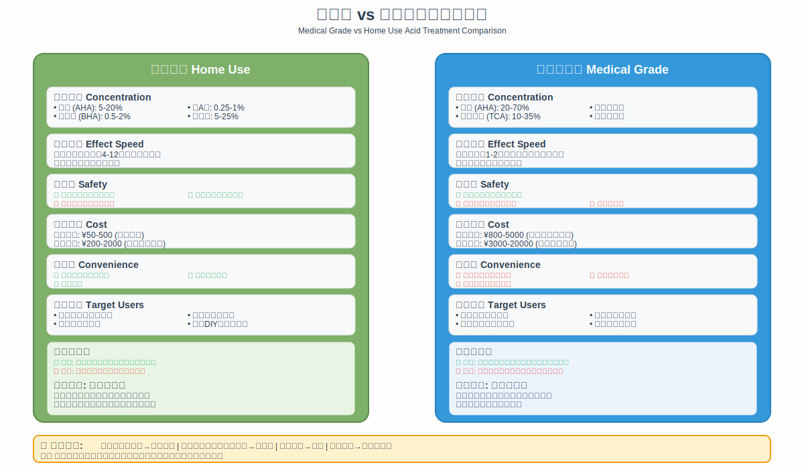

# 第9章：医美级刷酸项目

## 医美刷酸概述

医美级刷酸是在专业医疗机构进行的高浓度酸类治疗，属于医疗美容范畴。与家用刷酸产品相比，医美级刷酸使用更高浓度的酸类成分，能够达到更深的作用层次，产生更显著的治疗效果。

这类治疗需要在专业医生的操作和监督下进行，通过精确控制酸类浓度、作用时间和渗透深度，实现对各种肌肤问题的针对性治疗。医美级刷酸的安全性和有效性很大程度上依赖于操作者的专业水平和经验。

*图9-1：医美级与家用刷酸的对比分析*

### 医美刷酸的技术原理

医美级刷酸的核心原理是利用高浓度酸类成分快速破坏角质细胞间的连接结构，促进老化角质的大量脱落。这个过程比家用产品更加迅速和彻底，能够在短时间内实现显著的肌肤改善。

不同类型的酸类具有不同的渗透特性和作用机制。果酸类由于分子较小，能够渗透到表皮的较深层次。水杨酸的脂溶性特点使其能够深入毛孔发挥作用。三氯醋酸等强酸类甚至能够作用到真皮浅层，产生更深层的组织重塑效果。

医美级刷酸会引起可控的炎症反应，这种炎症反应是治疗效果的重要组成部分。适度的炎症能够激活肌肤的自我修复机制，促进胶原蛋白合成，改善肌肤质感和弹性。专业医生的作用就是精确控制这种炎症反应的程度和范围。

### 医美刷酸与家用刷酸的区别

医美级刷酸与家用刷酸在多个方面存在显著差异。首先是酸类浓度，医美级产品的浓度通常在20%-70%之间，远高于家用产品的2%-20%。这种浓度差异直接决定了治疗效果的强度和速度。

作用深度是另一个重要区别。家用产品主要作用于角质层表面，而医美级治疗可以深入到表皮的各个层次，甚至真皮浅层。这种深度差异使得医美级治疗能够处理更严重的肌肤问题。

治疗效果的显现速度也不同。家用产品需要持续使用数周到数月才能看到明显效果，而医美级治疗往往在单次治疗后就能看到显著改善。但相应地，医美级治疗的恢复期也更长，可能需要数天到数周的时间。

安全保障方面，医美级治疗有专业医生的操作和监督，能够及时处理可能出现的不良反应。而家用产品主要依靠使用者的自我判断和控制，安全性相对较低。

## 医美刷酸项目分类

### 浅层焕肤

浅层焕肤是最常见的医美刷酸项目，主要作用于表皮层，包括角质层、透明层、颗粒层和棘层。这类治疗的安全性相对较高，恢复期较短，适合大多数肌肤问题的治疗。

果酸焕肤是浅层焕肤的代表项目。使用的果酸浓度通常在20%-35%之间，能够有效去除老化角质，改善肌肤质感，减少细纹和色斑。果酸焕肤的治疗过程相对简单，单次治疗时间约为30-60分钟。

水杨酸焕肤特别适合油性肌肤和痤疮问题的治疗。水杨酸的脂溶性特点使其能够深入毛孔，清除堆积的油脂和角质，同时发挥抗炎作用。水杨酸焕肤的浓度通常在20%-30%之间。

乳酸焕肤是相对温和的选择，特别适合敏感肌肤和干性肌肤。乳酸具有天然的保湿特性，在去角质的同时能够帮助肌肤保持水分。乳酸焕肤的浓度通常在15%-25%之间。

### 中层焕肤

中层焕肤的作用深度达到真皮乳头层，能够处理更严重的肌肤问题，如深层色斑、明显皱纹、痤疮疤痕等。这类治疗的效果更加显著，但相应的风险和恢复期也更长。

三氯醋酸是中层焕肤的主要成分，浓度通常在35%-50%之间。三氯醋酸具有强烈的蛋白质凝固作用，能够引起表皮的完全剥脱和真皮的部分重塑。这种治疗的效果非常显著，但需要更长的恢复期。

复合酸中层焕肤结合了多种酸类的优势，通过科学配比实现协同效应。这种方法能够在保证效果的同时降低单一酸类可能带来的副作用。

中层焕肤的恢复过程相对复杂，通常需要1-2周的时间。在恢复期间，肌肤会出现明显的脱皮和红肿，需要严格的护理和防晒。

### 深层焕肤

深层焕肤是最强烈的化学焕肤治疗，作用深度可达真皮中层。这类治疗主要用于处理严重的光老化、深层皱纹、明显疤痕等问题。由于风险较高，深层焕肤的应用相对较少。

苯酚是深层焕肤的主要成分，具有极强的渗透性和破坏性。苯酚焕肤能够引起真皮的深层重塑，效果接近手术治疗。但这种治疗的风险也很高，可能出现色素沉着、疤痕形成等并发症。

深层焕肤的恢复期可能长达数月，需要专业的医疗监护和护理。由于风险和复杂性，深层焕肤通常只在专业的整形外科或皮肤科医院进行。

## 治疗流程与操作规范

### 术前评估

医美级刷酸治疗前的评估是确保安全和效果的关键环节。专业医生需要对患者的肌肤状况、健康状态、治疗期望等进行全面评估。

肌肤评估包括肌肤类型、问题严重程度、屏障功能状态、敏感性等方面。医生会使用专业设备进行客观检测，如肌肤水分测试、油脂分泌测试、色素分析等。

健康状态评估需要了解患者的过敏史、用药史、既往治疗史等。某些疾病或药物可能影响治疗的安全性和效果，需要特别注意。

治疗期望的沟通也很重要。医生需要向患者详细说明治疗的预期效果、可能的风险、恢复过程等，确保患者有合理的期望。

### 治疗操作

医美级刷酸的治疗操作需要严格按照规范进行，确保安全和效果。整个过程通常包括清洁准备、酸类涂抹、中和处理、术后护理等步骤。

清洁准备阶段需要彻底清除肌肤表面的油脂、污垢和化妆品残留，为酸类的均匀渗透创造条件。通常使用专业的清洁剂和脱脂剂进行处理。

酸类涂抹是治疗的核心环节。医生需要根据患者的具体情况选择合适的酸类和浓度，按照标准程序进行涂抹。涂抹过程中需要密切观察肌肤反应，及时调整治疗参数。

中和处理是确保安全的重要步骤。当达到预定的治疗效果或出现过度反应时，需要立即使用中和剂停止酸类的作用，并用大量清水冲洗。

术后护理包括舒缓处理、保湿护理、防晒保护等。这些措施有助于减轻不适感，促进恢复，预防并发症。

### 术后管理

医美级刷酸治疗后的管理对于确保效果和安全同样重要。患者需要严格按照医生的指导进行护理，定期复诊检查。

恢复期的护理重点是保湿、防晒、避免刺激。患者需要使用温和的护肤品，避免使用含有刺激性成分的产品。严格的防晒是预防色素沉着的关键。

复诊检查有助于及时发现和处理可能出现的问题。医生会评估恢复情况，调整护理方案，决定是否需要后续治疗。

长期维护包括定期的维护性治疗和日常护理。医美级刷酸的效果虽然显著，但不是永久性的，需要通过定期治疗和良好的日常护理来维持。

## 适应症与禁忌症

### 主要适应症

医美级刷酸适用于多种肌肤问题的治疗，但需要根据具体情况选择合适的治疗方案。

光老化是医美级刷酸的主要适应症之一。包括日晒斑、老年斑、细纹、皱纹、肌肤粗糙等问题。不同程度的光老化需要选择不同深度的焕肤治疗。

痤疮及其后遗症也是常见的适应症。包括活动性痤疮、痤疮疤痕、炎症后色素沉着等。水杨酸焕肤对这类问题特别有效。

色素性疾病如黄褐斑、炎症后色素沉着、雀斑等也可以通过医美级刷酸治疗。但需要注意的是，某些类型的色素沉着可能在治疗后出现反弹。

毛孔粗大、肌肤质感粗糙等问题也可以通过医美级刷酸得到改善。这类问题通常需要多次治疗才能达到理想效果。

### 主要禁忌症

医美级刷酸也有一些绝对和相对禁忌症，需要严格掌握。

绝对禁忌症包括活动性皮肤感染、开放性伤口、严重的免疫系统疾病、妊娠和哺乳期等。这些情况下进行治疗可能导致严重的并发症。

相对禁忌症包括敏感肌肤、近期接受过其他美容治疗、正在使用某些药物等。这些情况需要谨慎评估，可能需要调整治疗方案或延迟治疗。

患者的心理状态也是需要考虑的因素。对治疗效果有不切实际期望或心理承受能力较差的患者可能不适合接受治疗。

## 风险与并发症

### 常见风险

医美级刷酸虽然相对安全，但仍存在一定的风险和并发症。了解这些风险有助于做好预防和处理。

色素沉着是最常见的并发症之一，特别是在深肤色人群中。这种并发症通常是暂时性的，但可能需要数月的时间才能完全消退。

感染是另一个需要警惕的风险。虽然发生率较低，但一旦发生可能导致严重后果。严格的无菌操作和术后护理是预防感染的关键。

疤痕形成是深层焕肤的潜在风险。虽然发生率很低，但一旦形成可能是永久性的。选择有经验的医生和合适的治疗深度是预防疤痕的重要措施。

### 风险预防

预防并发症的关键在于严格的适应症选择、规范的操作技术和完善的术后管理。

术前的充分评估和准备是预防并发症的基础。包括详细的病史询问、全面的肌肤检查、合理的治疗方案制定等。

规范的操作技术是确保安全的关键。医生需要具备丰富的经验和熟练的技术，严格按照操作规程进行治疗。

完善的术后管理包括详细的护理指导、定期的复诊检查、及时的问题处理等。患者的配合和依从性对于预防并发症同样重要。

## 效果评估与维护

### 效果评估标准

医美级刷酸的效果评估需要客观和主观指标相结合。客观指标包括肌肤质感、色素分布、细纹深度等可以量化的参数。主观指标包括患者的满意度、生活质量改善等。

治疗效果的评估通常在治疗后1个月、3个月、6个月进行。这样可以全面了解治疗的即时效果和长期效果。

摄影记录是效果评估的重要工具。标准化的摄影条件和角度有助于客观比较治疗前后的变化。

### 效果维护

医美级刷酸的效果虽然显著，但不是永久性的。维护效果需要定期的维护性治疗和良好的日常护理。

维护性治疗的频率通常为3-6个月一次，具体间隔根据个人情况和治疗效果确定。维护性治疗的强度通常比初次治疗要轻。

日常护理的重点是防晒、保湿、使用合适的护肤品。严格的防晒是维护效果的关键，可以预防新的光老化损伤。

生活方式的调整也有助于维护效果。包括健康的饮食、充足的睡眠、适当的运动、压力管理等。

## 本章要点总结

医美级刷酸是专业的医疗美容治疗，具有显著的效果和相对较高的安全性。但这类治疗需要在专业医生的操作和监督下进行，患者需要充分了解治疗的适应症、禁忌症、风险和注意事项。

不同深度的焕肤治疗适用于不同的肌肤问题。浅层焕肤安全性高，适合大多数问题；中层焕肤效果显著，但恢复期较长；深层焕肤效果最强，但风险也最高。

治疗的成功不仅取决于操作技术，还与术前评估、术后管理、患者配合等因素密切相关。选择有资质和经验的医生、正规的医疗机构是确保安全和效果的前提。

医美级刷酸的效果需要通过定期维护来保持。患者需要建立长期的护理观念，结合专业治疗和日常护理来维护理想的肌肤状态。

---

了解了医美级刷酸项目后，接下来我们将学习如何识别和控制刷酸过程中的风险。让我们进入下一章"刷酸安全与风险防控"，确保安全有效地进行刷酸治疗！
