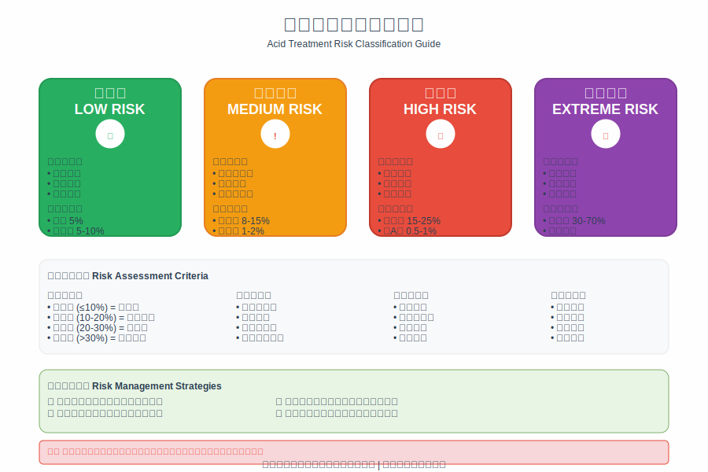

# 第10章：刷酸安全与风险防控

## 开篇：安全防控的重要性

刷酸安全是化学性去角质成功的基础和前提。虽然现代酸类产品的安全性不断提高，但由于涉及化学成分对肌肤的直接作用，仍然存在一定的风险。建立完善的安全防控体系，能够最大程度地降低风险，确保安全有效地实现护肤目标。

安全防控不仅包括对可能出现的副作用的识别和处理，还包括预防措施的建立、风险因素的评估、应急处理方案的制定等多个方面。只有全面系统地考虑安全问题，才能在享受刷酸益处的同时避免不必要的风险。

*图10-1：刷酸风险等级分类与应对策略*

## 常见副作用及处理

### 轻度副作用

轻度副作用是刷酸过程中最常见的反应，通常表现为轻微的刺激感、干燥或脱皮。这些反应在大多数情况下是正常的肌肤适应过程，不需要过度担心，但需要正确处理。

轻度刺激反应通常表现为使用产品后几分钟内出现的轻微刺痛或灼热感。这种感觉类似于轻微的蚊虫叮咬，通常在5-30分钟内自然消退。刺激感主要出现在角质层较薄或较敏感的区域，如眼周、嘴角等部位。

出现轻度刺激时，应该停止按摩或摩擦，让产品自然吸收。避免用手触摸刺激区域，以免加重反应。可以用冷毛巾轻敷5-10分钟来缓解不适感。大多数情况下，这种刺激会自然缓解，不需要特殊处理。

轻度干燥脱皮是另一种常见的轻度副作用。表现为肌肤比平时更加干燥，可能出现细小的皮屑，主要发生在T区、鼻翼等角质较厚的部位。这种现象通常持续3-7天，是肌肤新陈代谢加快的正常表现。

处理轻度干燥脱皮的关键是加强保湿护理。选择温和、滋润的保湿产品，避免使用含有刺激性成分的护肤品。不要用手撕扯脱皮，让其自然脱落。如果脱皮严重，可以暂时停用酸类产品，专注于修复护理。

### 中度副作用

中度副作用的严重程度明显高于轻度反应，可能对日常生活造成一定影响。这类反应需要更加积极的处理措施，并可能需要调整使用方案。

明显的红肿是中度副作用的典型表现。肌肤出现明显的红色，可能伴随轻微的肿胀，触摸时有温热感。这种红肿通常比轻度刺激更加持久，可能持续数小时到数天。

处理明显红肿的首要措施是立即停止使用酸类产品。用清水彻底清洗面部，去除残留的产品。可以使用冷敷来缓解红肿，每次10-15分钟，每天2-3次。选择含有舒缓成分的护肤品，如芦荟、洋甘菊等。

严重脱皮是另一种中度副作用，表现为大面积的皮肤脱落，可能影响外观和舒适度。这种情况通常发生在使用浓度过高或频率过密的情况下。

处理严重脱皮需要暂停所有酸类产品的使用，专注于修复和保湿护理。使用温和的清洁产品，避免物理摩擦。选择含有修复成分的护肤品，如神经酰胺、透明质酸等。严格防晒，避免紫外线对受损肌肤的进一步伤害。

### 重度副作用

重度副作用是最严重的不良反应，可能对肌肤造成持久性损伤。这类反应需要立即停止使用并寻求专业医疗帮助。

化学性皮炎是重度副作用的典型表现，症状包括严重的红肿、疼痛、水泡形成等。这种反应通常是由于酸类浓度过高、使用时间过长或个体过敏引起的。

出现化学性皮炎时，应立即用大量清水冲洗面部，去除所有残留的化学物质。不要使用任何护肤品，避免进一步刺激。立即就医，寻求专业的皮肤科治疗。

过敏反应是另一种重度副作用，可能表现为全身性的皮疹、瘙痒、呼吸困难等症状。这种反应需要紧急医疗处理。

预防重度副作用的关键是严格遵循使用指导，从低浓度开始，逐步建立耐受性。进行充分的皮肤测试，了解个人的敏感性。选择质量可靠的产品，避免使用来源不明的产品。

## 风险因素识别

### 个体风险因素

个体风险因素是影响刷酸安全性的重要因素，需要在开始使用前进行全面评估。

肌肤类型是最重要的个体风险因素之一。敏感性肌肤对酸类的耐受性较差，更容易出现不良反应。干性肌肤由于屏障功能相对较弱，也需要特别注意。油性肌肤虽然耐受性相对较好，但也不能掉以轻心。

年龄因素也会影响刷酸的安全性。年轻肌肤通常恢复能力较强，对酸类的耐受性也相对较好。而成熟肌肤或老化肌肤的屏障功能可能有所下降，需要更加谨慎。

健康状况是另一个重要的风险因素。某些疾病如湿疹、银屑病等会影响肌肤的屏障功能和敏感性。正在服用某些药物的人群也需要特别注意，如维A酸类药物、某些抗生素等可能增加光敏感性。

遗传因素也会影响个体对酸类的反应。有过敏体质或家族过敏史的人群通常风险较高。了解个人和家族的过敏史有助于评估风险。

### 产品风险因素

产品相关的风险因素主要包括酸类类型、浓度、pH值、配方等方面。

酸类类型决定了产品的基本特性和风险水平。强酸如甘醇酸的风险通常高于温和酸如乳酸。复合酸的风险评估需要考虑各个成分的相互作用。

浓度是最直接的风险因素。高浓度产品的效果虽然更显著，但风险也相应增加。选择合适的浓度需要平衡效果和安全性。

pH值影响酸类的活性和刺激性。过低的pH值会增加刺激性，而过高的pH值可能影响效果。理想的pH值范围因酸类而异。

产品配方中的其他成分也可能影响安全性。某些防腐剂、香精、色素等可能引起过敏反应。选择成分简单、无刺激性添加剂的产品相对更安全。

### 使用风险因素

使用方法和环境因素也会显著影响刷酸的安全性。

使用频率是重要的风险因素。过于频繁的使用会导致肌肤屏障受损，增加不良反应的风险。建立合理的使用频率需要考虑个人耐受性和产品特性。

使用时间的长短也会影响安全性。长时间接触酸类会增加刺激性。严格按照产品说明控制使用时间是确保安全的重要措施。

环境因素如温度、湿度、紫外线等也会影响刷酸的安全性。高温高湿的环境可能增加产品的渗透性，而强烈的紫外线会增加光敏感反应的风险。

同时使用其他护肤品也可能带来风险。某些成分组合可能产生不良相互作用，增加刺激性或降低安全性。

## 预防措施建立

### 使用前预防

建立完善的使用前预防措施是确保刷酸安全的第一道防线。

皮肤测试是最重要的预防措施之一。在正式使用前，应在耳后或手腕内侧进行小面积测试，观察24-48小时是否出现不良反应。即使测试没有问题，正式使用时也要从小面积开始。

产品选择需要谨慎进行。选择知名品牌、质量可靠的产品，避免使用来源不明或价格异常低廉的产品。仔细阅读产品说明，了解成分、浓度、使用方法等信息。

肌肤状态评估有助于确定是否适合开始刷酸。如果肌肤正处于敏感状态、有炎症或损伤，应该等待恢复后再开始使用。

环境因素的考虑也很重要。选择合适的季节和时间开始刷酸，避免在紫外线强烈的夏季或肌肤状态不稳定的时期开始。

### 使用中预防

使用过程中的预防措施能够及时发现和处理问题，避免不良反应的加重。

密切观察肌肤反应是使用中预防的核心。每次使用后都要仔细观察肌肤的变化，包括颜色、质感、敏感性等方面。发现异常要及时调整使用方案。

循序渐进的原则需要严格遵循。从最低浓度开始，逐步增加浓度和频率。给肌肤充分的适应时间，不要急于求成。

正确的使用方法是确保安全的基础。严格按照产品说明使用，不要随意增加用量或延长使用时间。避开眼周、唇部等敏感区域。

配套护理措施要及时跟上。加强保湿和防晒护理，避免使用其他刺激性产品。保持良好的生活习惯，为肌肤创造良好的恢复环境。

### 使用后预防

使用后的预防措施主要针对可能出现的延迟反应和长期影响。

持续观察是使用后预防的重点。某些反应可能在使用后数小时甚至数天才出现，需要持续关注肌肤状态的变化。

防晒保护在使用后变得更加重要。酸类会增加肌肤对紫外线的敏感性，严格的防晒是预防色素沉着和其他光敏感反应的关键。

定期评估使用效果和安全性有助于及时调整方案。如果效果不佳或出现不良反应，要及时调整产品选择或使用方法。

建立使用记录有助于总结经验和发现规律。记录使用的产品、浓度、频率、反应等信息，为后续的使用提供参考。

## 应急处理方案

### 轻度反应处理

轻度反应的应急处理重点是缓解症状，防止反应加重。

立即停止使用是处理任何不良反应的第一步。即使是轻度反应，也要暂停使用酸类产品，给肌肤恢复的时间。

清洁处理有助于去除残留的产品。用清水轻柔地清洗面部，避免使用清洁力过强的产品。不要用力摩擦，以免加重刺激。

冷敷处理可以缓解轻度的红肿和刺激。用干净的毛巾包裹冰块，轻敷在受影响的区域，每次10-15分钟。

舒缓护理有助于加速恢复。使用含有舒缓成分的护肤品，如芦荟胶、洋甘菊精华等。避免使用含有酒精、香精等刺激性成分的产品。

### 中度反应处理

中度反应需要更积极的处理措施，可能需要寻求专业建议。

立即彻底清洗是处理中度反应的紧急措施。用大量清水冲洗面部，确保完全去除残留的化学物质。如果有条件，可以用生理盐水冲洗。

抗炎处理有助于控制炎症反应。可以使用非处方的抗炎药膏，如氢化可的松软膏等。但要注意用量和使用时间，避免长期使用。

保湿修复是中度反应处理的重要环节。选择温和、无刺激的保湿产品，加强肌肤屏障的修复。可以使用含有神经酰胺、透明质酸等修复成分的产品。

避免进一步刺激是防止反应加重的关键。暂停所有功效性护肤品的使用，避免化妆和日晒。保持面部清洁干燥，避免用手触摸。

### 重度反应处理

重度反应需要紧急医疗处理，不能延误治疗时机。

紧急冲洗是处理重度反应的第一步。立即用大量清水冲洗面部和眼部，持续冲洗15-20分钟。如果有化学物质溅入眼中，要特别注意眼部的冲洗。

立即就医是处理重度反应的必要措施。不要等待症状自行缓解，应该立即前往医院的急诊科或皮肤科就诊。

保存产品信息有助于医生的诊断和治疗。将使用的产品带到医院，或记录产品的详细信息，包括品牌、成分、浓度等。

避免自行处理重度反应。不要使用任何药物或护肤品，等待专业医生的处理。保持冷静，配合医生的检查和治疗。

## 特殊人群注意事项

### 敏感肌肤人群

敏感肌肤人群在使用酸类产品时需要格外谨慎，采取更严格的安全措施。

产品选择要更加严格。选择专门为敏感肌肤设计的产品，优先选择温和的酸类如乳酸、PHA等。避免使用高浓度或复合酸产品。

建立耐受性的过程要更加缓慢。从最低浓度开始，延长适应期。可能需要数周甚至数月的时间才能建立稳定的耐受性。

使用频率要严格控制。初期可能只能每周使用一次，根据肌肤反应逐步调整。不要急于增加使用频率。

配套护理要更加重视。选择专门的敏感肌护肤品，加强屏障修复和舒缓护理。严格防晒，避免任何可能的刺激因素。

### 孕期和哺乳期女性

孕期和哺乳期女性使用酸类产品需要特别谨慎，某些成分可能对胎儿或婴儿产生影响。

成分选择要严格筛选。避免使用维A酸类成分，这类成分可能对胎儿发育产生影响。优先选择相对安全的果酸类产品。

浓度控制要更加严格。使用最低有效浓度，避免高浓度产品。如果可能，最好在医生指导下使用。

使用频率要适当降低。减少使用频率，给肌肤更多的恢复时间。密切观察肌肤反应，及时调整使用方案。

咨询专业意见是明智的选择。在开始使用前，最好咨询皮肤科医生或妇产科医生的意见，确保安全性。

### 青少年人群

青少年的肌肤特点和成人不同，在使用酸类产品时需要特殊考虑。

肌肤特点要充分了解。青少年肌肤通常油脂分泌旺盛，但屏障功能可能还不够成熟。需要选择适合的产品和使用方法。

家长监督是必要的。青少年可能缺乏足够的安全意识和处理经验，需要家长的指导和监督。

教育引导要及时跟上。让青少年了解正确的使用方法和安全注意事项，培养良好的护肤习惯。

专业指导要及时寻求。如果出现严重的痤疮问题，应该及时寻求皮肤科医生的专业治疗，不要仅依赖护肤品。

## 本章要点总结

刷酸安全是化学性去角质成功的基础和前提。建立完善的安全防控体系，包括风险识别、预防措施、应急处理等多个环节，能够最大程度地降低风险。

常见的副作用包括轻度、中度和重度三个等级，需要采取相应的处理措施。轻度反应通常可以自行缓解，中度反应需要积极处理，重度反应需要紧急医疗干预。

风险因素的识别和评估是预防不良反应的重要环节。个体因素、产品因素、使用因素都会影响安全性，需要综合考虑。

预防措施的建立应该贯穿使用的全过程，包括使用前、使用中、使用后三个阶段。每个阶段都有相应的预防重点和措施。

特殊人群如敏感肌肤、孕期女性、青少年等需要采取更严格的安全措施，必要时寻求专业指导。

记住，安全永远比效果更重要。在追求护肤效果的同时，一定要把安全放在第一位。通过科学的方法和严格的安全措施，可以在享受刷酸益处的同时避免不必要的风险。

---

掌握了安全防控的要点后，接下来我们将学习如何评估和调整刷酸效果。让我们进入下一章"刷酸效果评估与调整"，学会科学地评估和优化刷酸方案！
