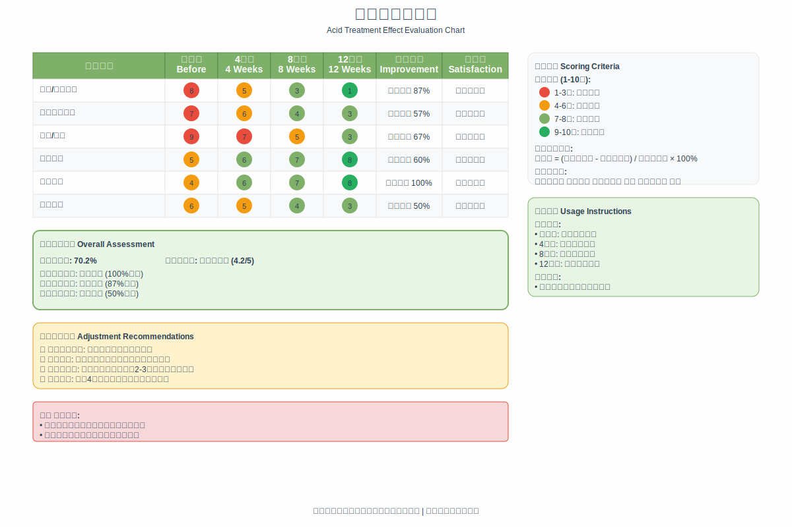

# 第11章：刷酸效果评估与调整

## 开篇：科学评估的重要性

刷酸效果的科学评估是优化护肤方案的重要环节。通过系统性的评估，可以客观了解治疗效果，及时发现问题，并根据实际情况调整使用方案。这种基于数据的决策方式能够最大化刷酸的效果，同时避免不必要的风险。

效果评估不仅包括对肌肤改善程度的观察，还包括对安全性、耐受性、使用体验等多个方面的综合评价。只有全面系统的评估，才能为后续的方案调整提供可靠的依据。

*图11-1：刷酸效果多维度评估表*

## 科学评估刷酸效果

### 效果评估的时间节点

刷酸效果的评估需要在不同的时间节点进行，以全面了解治疗的进展和效果。

短期评估通常在使用1-4周后进行，主要关注肌肤的适应性和安全性。这个阶段的重点是观察是否出现不良反应，肌肤是否能够耐受所使用的产品。同时，也要关注肌肤质感的初步变化，如光滑度、细腻度等基础指标的改善。

中期评估在使用1-3个月后进行，这是评估初步效果的关键时期。大多数肌肤问题在这个时期会开始显现改善迹象。评估的重点包括主要肌肤问题的改善程度、副作用的控制情况、以及是否需要调整使用方案。

长期评估在使用3-6个月后进行，主要评估最终效果和稳定性。这个阶段需要综合评价整个治疗过程的效果，分析投入产出比，并制定后续的维护方案。

### 多维度效果评估体系

科学的效果评估需要建立多维度的评估体系，从不同角度全面评价刷酸的效果。

肌肤质感改善是最直观的评估维度。包括肌肤的光滑度、细腻度、透明感等指标。这些指标可以通过触觉感受和视觉观察进行评估，也可以使用专业设备进行客观测量。

具体问题改善是针对性评估的重要内容。根据使用刷酸的初始目标，评估相应问题的改善程度。如痤疮问题的减少、色斑的淡化、细纹的改善、毛孔的收缩等。

安全性评估是不可忽视的重要维度。包括不良反应的发生情况、肌肤耐受性的变化、屏障功能的状态等。安全性评估的结果直接影响是否继续使用和如何调整方案。

使用体验评估反映了主观感受和满意度。包括产品的使用感受、护肤流程的便利性、心理满意度等。这些主观指标对于长期坚持使用同样重要。

### 客观评估方法

客观评估方法能够提供可量化、可比较的数据，是科学评估的重要组成部分。

摄影记录是最常用的客观评估方法。在相同的光线条件、角度和距离下拍摄照片，通过对比不同时期的照片来评估效果。建议在开始使用前、使用1个月后、3个月后、6个月后分别拍摄记录照片。

肌肤参数测试可以提供更精确的数据。如果有条件，可以使用专业设备测试肌肤的水分含量、油脂分泌量、弹性、色素分布等参数。这些客观数据能够更准确地反映肌肤状态的变化。

标准化评分表可以将主观感受转化为相对客观的数据。制定统一的评分标准，对各项指标进行定期评分，通过数据变化趋势来评估效果。

第三方评价也是客观评估的重要补充。请家人朋友对肌肤状态进行评价，可以减少自我评估的主观偏差。

### 主观评估方法

主观评估虽然带有个人色彩，但反映了使用者的真实感受和满意度，同样具有重要价值。

自我感受评估是最直接的主观评估方法。定期记录对肌肤状态的感受，包括触感、外观、舒适度等方面的变化。

满意度评价反映了对治疗效果的整体满意程度。可以从效果满意度、安全性满意度、使用体验满意度等多个角度进行评价。

生活质量评估关注刷酸对日常生活的影响。包括自信心的变化、社交活动的参与度、化妆习惯的改变等。

期望达成度评估比较实际效果与初始期望的差距。这有助于调整期望值，制定更合理的目标。

## 效果不佳的原因分析

### 产品相关因素

当刷酸效果不理想时，首先需要分析产品相关的因素。

产品选择可能不适合个人肌肤特点。不同的酸类适用于不同的肌肤问题和肌肤类型，选择不当可能导致效果不佳。需要重新评估肌肤状况和需求，选择更合适的产品。

浓度可能不够或过高。浓度过低可能效果不明显，浓度过高可能导致不良反应而无法持续使用。需要根据肌肤耐受性和效果反馈调整浓度。

产品质量问题也可能影响效果。包括有效成分含量不足、pH值不合适、配方不稳定等。选择质量可靠的品牌和产品是确保效果的基础。

产品保存不当可能导致有效成分失活。酸类产品通常对光照、温度、空气敏感，需要正确保存以维持活性。

### 使用方法因素

使用方法的正确与否直接影响刷酸的效果。

使用频率可能不合适。频率过低可能效果不明显，频率过高可能导致肌肤不耐受。需要根据个人情况找到最适合的使用频率。

使用时间可能不够充分。刷酸需要一定的时间才能看到明显效果，过早放弃可能错失改善机会。

使用方法可能不正确。包括涂抹方式、用量控制、使用顺序等。需要严格按照产品说明和专业建议使用。

配套护理可能不到位。刷酸期间的保湿、防晒等配套护理对效果有重要影响。忽视这些护理可能影响整体效果。

### 个体差异因素

个体差异是影响刷酸效果的重要因素，需要充分考虑和理解。

肌肤类型和特点会影响对酸类的反应。不同肌肤类型对同一产品的反应可能完全不同，需要个性化调整。

年龄因素会影响肌肤的代谢速度和修复能力。年轻肌肤通常反应更快，而成熟肌肤可能需要更长时间。

健康状况和生活习惯也会影响效果。睡眠不足、压力过大、营养不良等都可能影响肌肤状态和治疗效果。

遗传因素决定了个体的基本肌肤特征。某些遗传性的肌肤问题可能对外用治疗反应有限。

### 环境因素

外部环境因素也可能影响刷酸的效果。

季节变化会影响肌肤状态和产品效果。不同季节的温度、湿度、紫外线强度都会影响刷酸的效果和安全性。

生活环境的空气质量、水质等也可能影响肌肤状态。污染严重的环境可能加重肌肤负担，影响治疗效果。

工作环境的特殊性也需要考虑。如经常接触化学物质、长期面对电脑屏幕等都可能影响肌肤状态。

## 方案调整策略

### 产品调整策略

当效果不理想时，可能需要调整所使用的产品。

更换酸类类型是常见的调整策略。如果当前使用的酸类效果不佳，可以尝试其他类型的酸类。例如，从果酸换到水杨酸，或者尝试复合酸配方。

调整产品浓度是精细化调整的重要手段。可以根据肌肤耐受性和效果反馈逐步调整浓度，找到最适合的浓度范围。

更换产品品牌可能带来不同的效果。不同品牌的配方、工艺、质量控制可能存在差异，更换品牌有时能够获得更好的效果。

添加辅助产品可以增强整体效果。如添加抗氧化精华、修复精华等，通过协同作用提高治疗效果。

### 使用方法调整

优化使用方法是提高效果的重要途径。

调整使用频率需要根据肌肤反应和效果进行。如果耐受性良好但效果不明显，可以适当增加频率；如果出现不良反应，需要降低频率。

改变使用时间可能带来不同的效果。有些人适合晚上使用，有些人可能白天使用效果更好，需要根据个人情况调整。

优化使用顺序和搭配可以提高产品的协同效应。合理安排不同产品的使用顺序，避免成分冲突，增强整体效果。

改进使用技巧包括涂抹方式、按摩手法等细节的优化。正确的使用技巧能够提高产品的渗透和效果。

### 配套护理调整

完善的配套护理是刷酸成功的重要保障。

加强保湿护理是最常见的调整措施。选择更适合的保湿产品，增加保湿步骤，帮助肌肤维持良好状态。

优化防晒保护对于维护刷酸效果至关重要。选择更高倍数的防晒产品，增加补涂频率，减少紫外线对肌肤的损害。

调整清洁护理可能对效果有重要影响。选择更温和的清洁产品，调整清洁频率，避免过度清洁。

添加修复护理有助于加速肌肤恢复和改善。使用含有修复成分的产品，帮助肌肤建立更好的状态。

### 生活方式调整

生活方式的调整对于提高刷酸效果同样重要。

改善睡眠质量有助于肌肤修复和再生。保证充足的睡眠时间，提高睡眠质量，为肌肤创造良好的修复环境。

优化饮食结构可以从内部支持肌肤健康。增加抗氧化食物的摄入，减少刺激性食物，保证营养均衡。

加强运动锻炼有助于促进血液循环和新陈代谢。适当的运动可以改善肌肤状态，但要注意运动后的清洁护理。

管理压力水平对于维持肌肤稳定状态很重要。学习压力管理技巧，保持良好的心理状态。

## 个性化方案制定

### 基于肌肤类型的个性化

不同肌肤类型需要制定不同的个性化方案。

干性肌肤的个性化方案应该重点关注保湿和温和性。选择具有保湿效果的酸类，如乳酸；降低使用频率，加强保湿护理；选择滋润型的配套产品。

油性肌肤的个性化方案可以相对积极一些。选择控油效果好的酸类，如水杨酸；可以使用相对较高的浓度和频率；注意清洁和控油护理。

敏感肌肤的个性化方案需要格外谨慎。选择最温和的酸类，如PHA；从最低浓度和频率开始；加强舒缓和修复护理。

混合性肌肤可以采用分区护理的策略。在不同区域使用不同的产品和方法，实现个性化的精准护理。

### 基于问题类型的个性化

针对不同的肌肤问题，需要制定相应的个性化方案。

痤疮问题的个性化方案应该重点关注抗炎和控油。选择具有抗炎作用的酸类，如水杨酸；配合抗炎护理产品；注意饮食和生活习惯的调整。

色斑问题的个性化方案需要重点关注美白和防晒。选择具有美白效果的酸类，如乳酸、杏仁酸；严格防晒保护；可以配合美白精华使用。

抗衰老的个性化方案应该关注胶原蛋白合成和肌肤紧致。选择促进胶原合成的酸类，如甘醇酸；配合抗衰老护理产品；注意营养和生活方式的调整。

毛孔问题的个性化方案需要关注深层清洁和收敛。选择能够深入毛孔的酸类，如水杨酸；配合收敛和紧致护理；注意控油和清洁。

### 基于生活方式的个性化

不同的生活方式也需要相应的个性化调整。

忙碌的上班族可能需要简化的护肤方案。选择使用方便的产品，简化护肤步骤，重点做好基础护理。

经常出差的人群需要便携和稳定的方案。选择旅行装产品，制定简化的护肤流程，注意环境变化的影响。

学生群体可能更关注性价比和安全性。选择经济实惠的产品，重点关注安全使用，避免影响学习和生活。

中老年人群需要更温和和全面的方案。选择温和的产品，加强抗衰老护理，注意与其他治疗的协调。

## 长期维护计划

### 维护性使用策略

当达到理想效果后，需要制定长期的维护计划来保持效果。

降低使用强度是维护期的常见策略。可以降低产品浓度、减少使用频率，维持最低有效的使用强度。

定期强化治疗可以帮助维持和巩固效果。每隔一段时间进行短期的强化治疗，如使用稍高浓度的产品或增加使用频率。

季节性调整有助于适应环境变化。根据不同季节的特点调整使用方案，如夏季降低强度，冬季加强保湿。

定期评估和调整确保维护方案的有效性。定期评估肌肤状态和维护效果，根据变化调整维护方案。

### 预防性护理措施

预防性护理是长期维护的重要组成部分。

严格防晒是预防新问题产生的关键。坚持使用防晒产品，避免长时间日晒，预防光老化和色素沉着。

保持良好的生活习惯有助于维持肌肤健康。包括规律作息、均衡饮食、适量运动、压力管理等。

定期专业护理可以提供更深层的维护。如定期做面部护理、专业检测等，及时发现和处理问题。

持续学习和更新护肤知识有助于优化护理方案。关注护肤科学的发展，学习新的护理方法和产品。

## 本章要点总结

刷酸效果的科学评估是优化护肤方案的重要环节。通过建立多维度的评估体系，在不同时间节点进行系统评估，可以客观了解治疗效果并及时调整方案。

效果不佳的原因可能涉及产品、使用方法、个体差异、环境因素等多个方面。需要全面分析，找出关键因素，制定针对性的调整策略。

方案调整包括产品调整、使用方法调整、配套护理调整、生活方式调整等多个层面。需要根据具体情况选择合适的调整策略。

个性化方案制定需要考虑肌肤类型、问题类型、生活方式等因素。只有真正个性化的方案才能获得最佳效果。

长期维护计划对于保持刷酸效果至关重要。需要制定维护性使用策略和预防性护理措施，确保效果的持续性。

记住，刷酸是一个动态的过程，需要持续的评估和调整。通过科学的方法和耐心的坚持，每个人都能找到最适合自己的刷酸方案，实现理想的肌肤状态。

---

掌握了效果评估和调整的方法后，接下来我们将探讨刷酸期间的生活管理。让我们进入下一章"刷酸期间的生活管理"，学会全方位地配合刷酸治疗！
